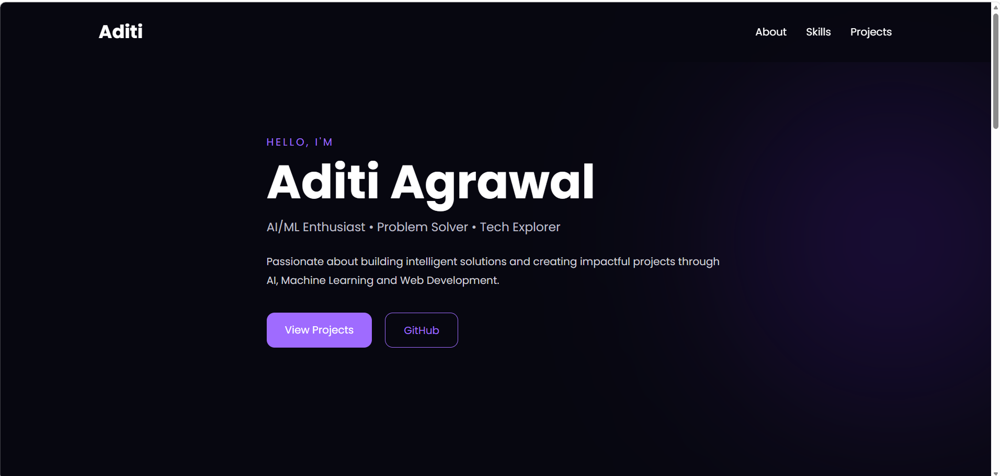
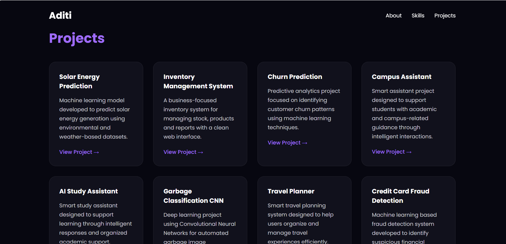

# Aditi Agrawal - Portfolio Website

A modern dark-themed personal portfolio website built using HTML and CSS to showcase my skills, projects and interests in AI/ML and Web Development.

## 🚀 Features

- Responsive modern UI
- Dark elegant tech-inspired theme
- Skills showcase section
- Project cards with GitHub links
- Smooth scrolling navigation
- Beginner-friendly structure

## 🛠️ Technologies Used

- HTML5
- CSS3
- Git & GitHub

## 📂 Projects Included

- Solar Energy Prediction
- Inventory Management System
- Churn Prediction
- Campus Assistant
- AI Study Assistant
- Garbage Classification CNN
- Travel Planner
- Credit Card Fraud Detection

## 📸 Preview

This portfolio highlights my work, technical interests and projects in Artificial Intelligence, Machine Learning and Web Development.

## 🔗 GitHub Profile

GitHub: https://github.com/aevinaa

## 📌 Purpose

This project was created as part of Week 1 Web Development tasks to practice:
- HTML fundamentals
- CSS styling
- Responsive layouts
- Git & GitHub workflow

## 👩‍💻 Author

Aditi Agrawal